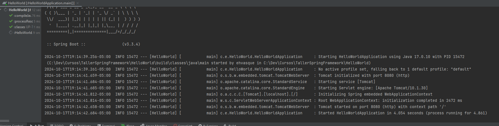
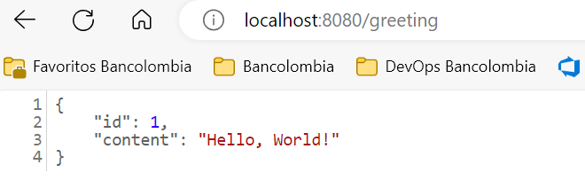
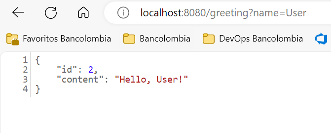

# HelloWorld

_Evidencias Practica Hola Mundo - Rest Service._

## Evidencias de ejecución 🚀

## Ejecucion Microservicio 🚀

## Evidencias Greeting 🚀

## Evidencias Greeting 1 🚀

## Autor ✒️

* **Erik Darío Hernández Vásquez** - *Trabajo Inicial* - [erikhernandezv]([https://github.com/erikhernandezv](https://github.com/erikhernandezv/TallerSpringFramework/tree/main/HelloWorld))

---
⌨️ con ❤️ por [erikhernandezv](https://github.com/erikhernandezv) 😊
