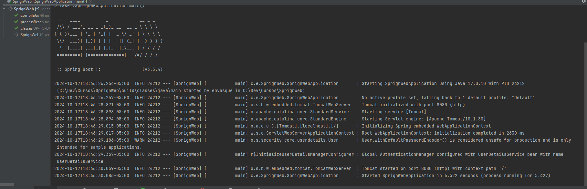
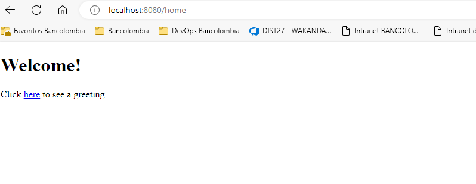
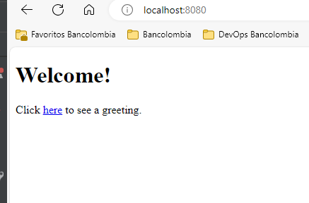
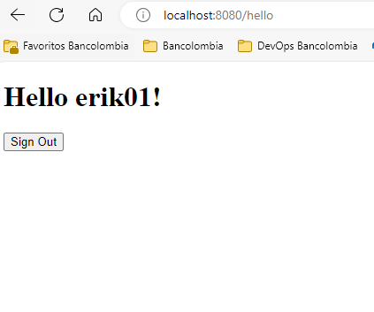

# TallerSpringFramework
Código de ejercicios en clase Curso Spring Framework

# SpringWeb

_Evidencias Practica Spring Security web._

## Evidencias de ejecución 🚀

## Ejecucion microservicio 🚀

## Evidencias Home 🚀

## Evidencias Login 🚀

## Evidencias Hello 🚀

## Autor ✒️

* **Erik Darío Hernández Vásquez** - *Trabajo Inicial* - [erikhernandezv]([https://github.com/erikhernandezv](https://github.com/erikhernandezv/TallerSpringFramework/tree/main/SprignWeb))

---
⌨️ con ❤️ por [erikhernandezv](https://github.com/erikhernandezv) 😊
